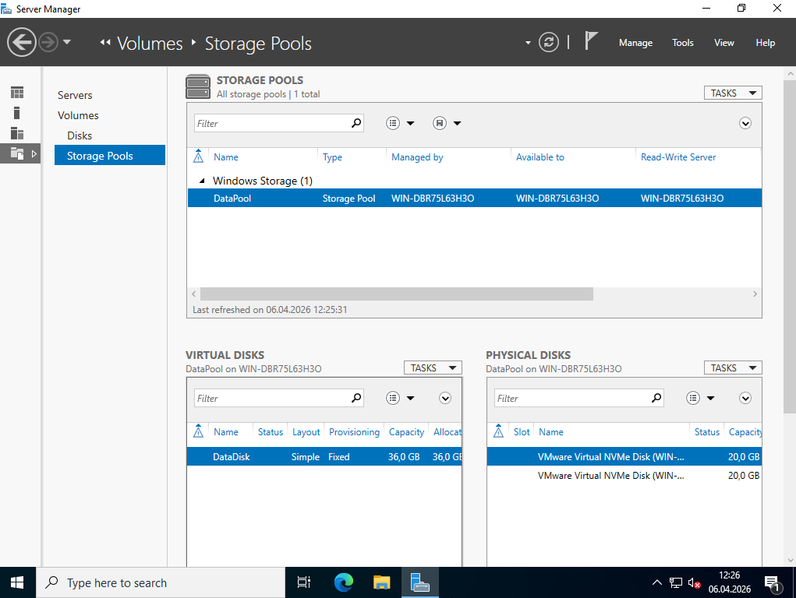
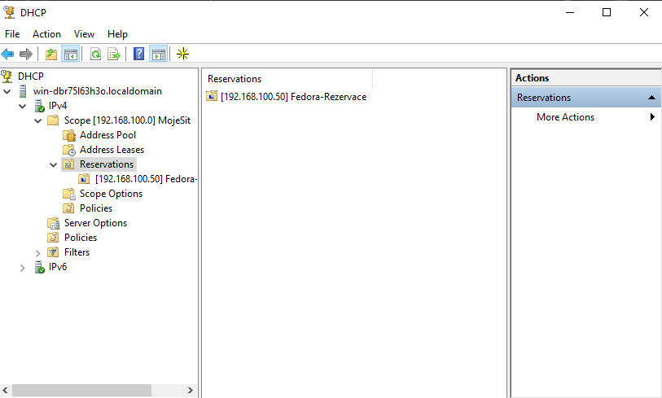
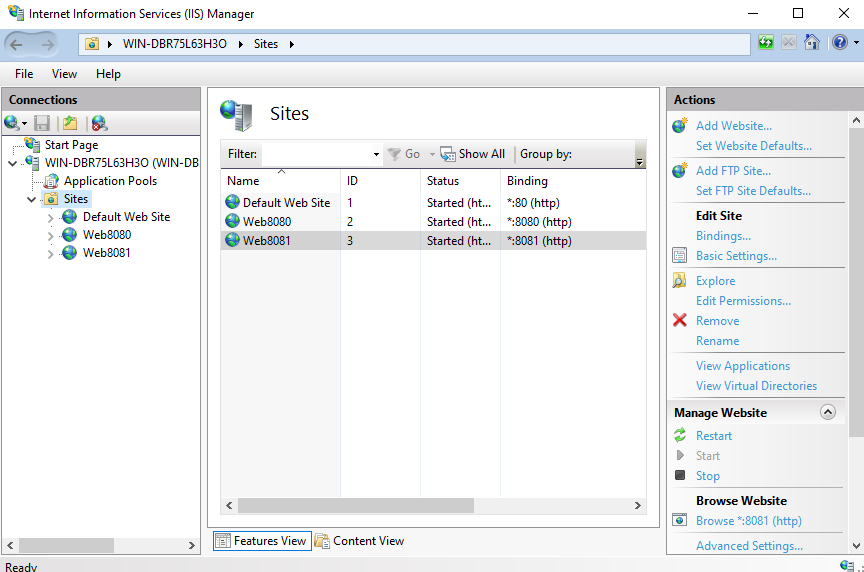
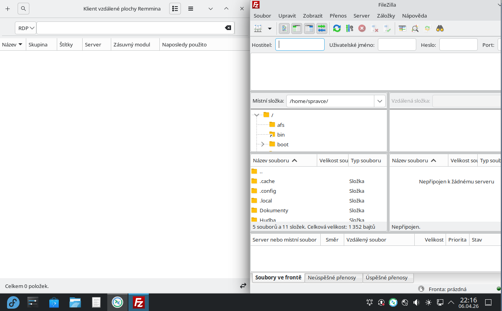
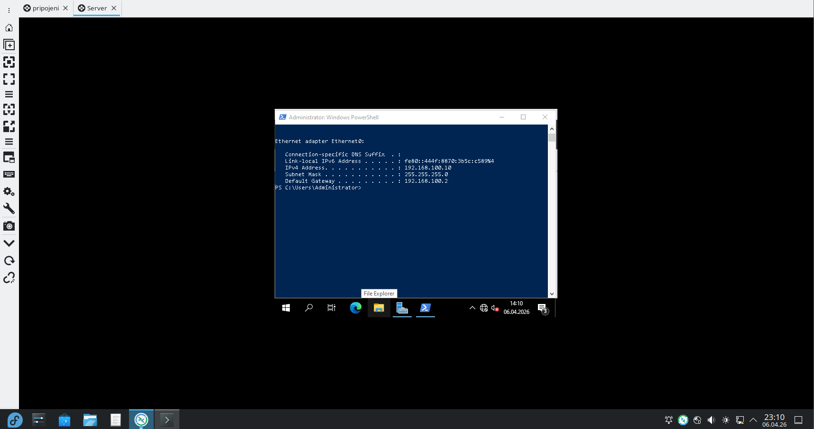
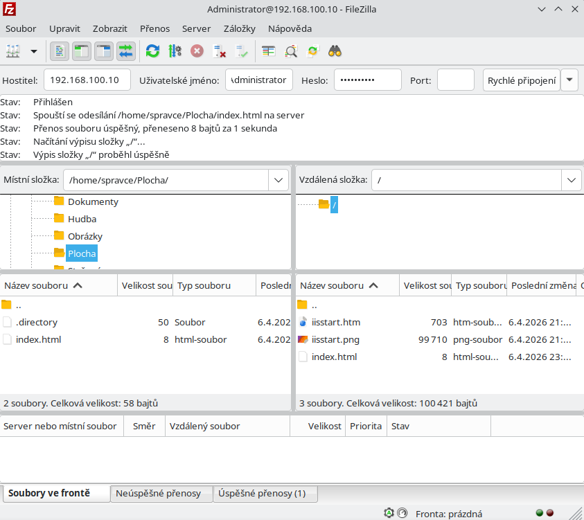
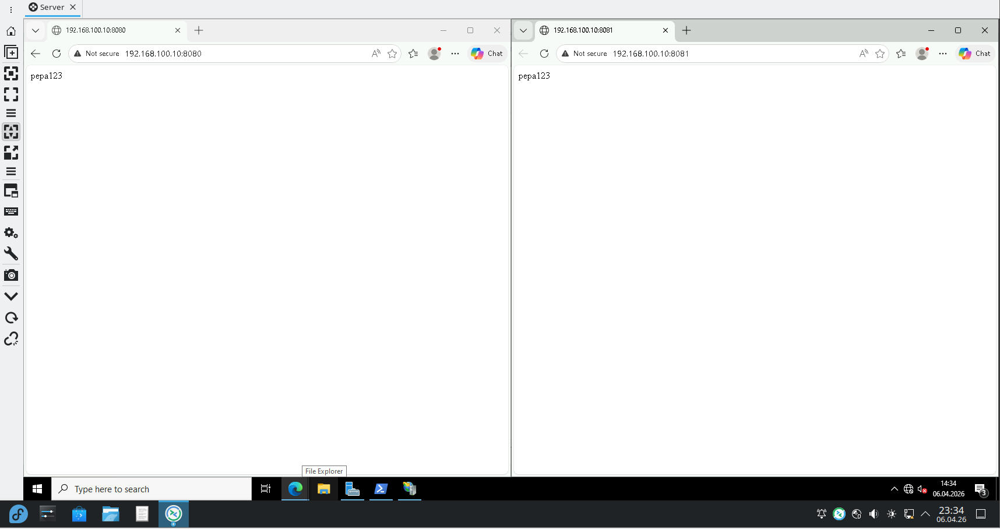

Dokumentace: Konfigurace Windows Serveru 2022 a Linuxového klienta
Autor: Jan Bergmann
Datum: 6. 4. 2026
1. Konfigurace Storage Spaces
V rámci Windows Serveru byl nakonfigurován Storage Pool (DataPool) složený ze dvou fyzických NVMe disků o kapacitě 20 GB. Z tohoto poolu byl vytvořen virtuální disk DataDisk s kapacitou 36 GB, který slouží jako logický svazek pro data webů.
 

 
2. Nastavení DHCP a IIS
•	DHCP: Pro klientskou stanici Fedora byla vytvořena rezervace na IP adresu 192.168.100.50.
•	IIS: V manageru Internetové informační služby (IIS) byly vytvořeny weby Web8080 a Web8081, které jsou spuštěny a naslouchají na příslušných portech.
 
 
 
 
3. Příprava prostředí na straně klienta
Na straně Linuxové Fedory byl spuštěn klient vzdálené plochy Remmina a připraven FTP klient FileZilla pro následnou práci se serverem.
 
 
 
4. Funkční RDP relace (Vzdálená plocha)
Z prostředí Fedora KDE bylo navázáno úspěšné RDP spojení na Windows Server (192.168.100.10). V rámci relace byla ověřena IP konfigurace serveru pomocí PowerShellu.
 
  
  
5. Přenos souboru index.html přes FTP
Pomocí aplikace FileZilla byl na server úspěšně přenesen soubor index.html. Na screenshotu je vidět potvrzení o úspěšném přenosu 8 bajtů dat a výpis vzdáleného adresáře se souborem.
 
  
6. Ověření funkčnosti webů
Finální ověření ukazuje funkční zobrazení obsahu souboru (text "pepa123") v prohlížeči na obou portech 8080 i 8081. Tím je potvrzena správná konfigurace IIS, úložiště i síťové konektivity.
 
 
